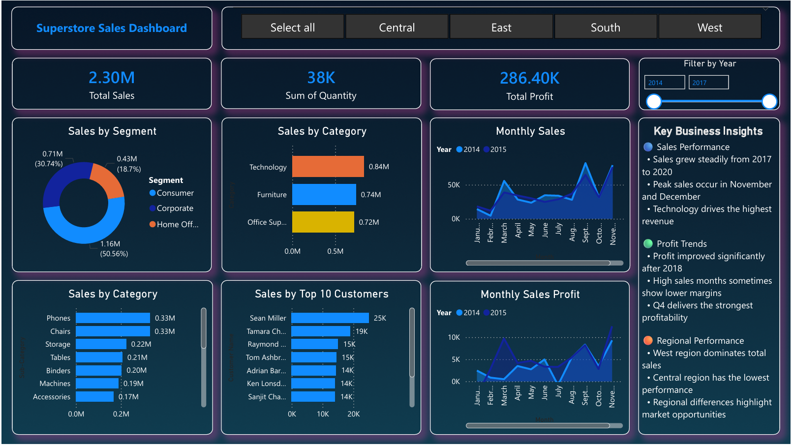

# Superstore Sales Dashboard (Power BI)

## Project Overview

This project analyzes the **Superstore dataset** using **Power BI** to uncover insights about sales performance, profitability, and regional trends.

The dashboard provides an **interactive visualization of key business metrics** including total sales, profit performance, monthly trends, and category-level analysis. It helps understand how sales vary across **regions, product categories, and time**.

---

## Dashboard Preview

---

## Key Business Insights

🔵 **Sales Performance**

* Sales show steady growth from **2017 to 2020**, indicating consistent business expansion.
* The **highest sales occur in November and December**, driven by seasonal demand and holiday purchases.
* The **Technology category contributes the highest share of revenue** compared to Furniture and Office Supplies.

🟢 **Profit Trends**

* Profit levels improve significantly after **2018**, suggesting better cost or pricing strategies.
* Some months show **high sales but lower profit**, indicating periods with heavy discounts.
* **Q4 (October–December)** consistently delivers the strongest profitability.

🟠 **Regional Performance**

* The **West region generates the highest revenue**, making it the top-performing market.
* The **Central region records the lowest sales**, highlighting potential areas for business improvement.
* Regional sales variation indicates opportunities for **targeted marketing strategies**.

---

## Dashboard Features

* KPI Cards showing **Total Sales, Total Profit, and Total Quantity**
* **Monthly Sales Trend** using area charts
* **Monthly Profit Trend** comparison across multiple years
* **Sales by Category** visualization
* **Region slicer** for interactive filtering
* Clean **business insight section** explaining trends in the data

---

## Tools Used

* **Power BI** – Data visualization and dashboard creation
* **Microsoft Excel** – Dataset preparation and exploration
* **GitHub** – Project documentation and version control

---

## Dataset Description

The dataset contains transactional sales information including:

* Order Date
* Sales
* Profit
* Product Category
* Sub-Category
* Customer Segment
* Region
* Quantity

This data helps analyze **sales patterns, profitability trends, and regional performance**.

---

## Author

**Shyam Sundar V**

Aspiring Data Scientist | Data Analytics Enthusiast
